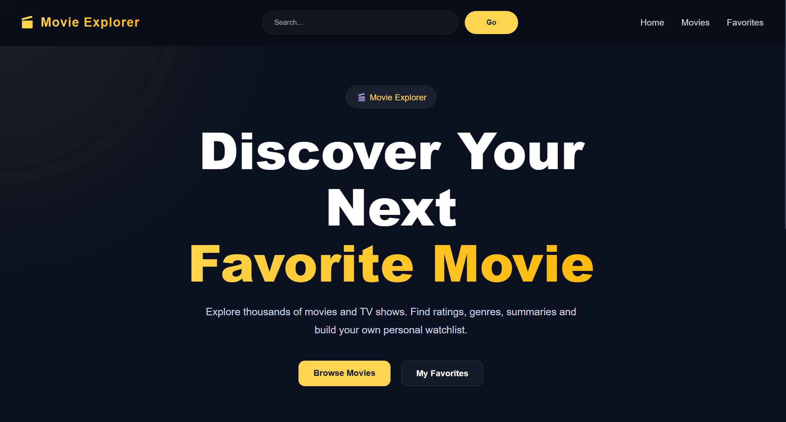
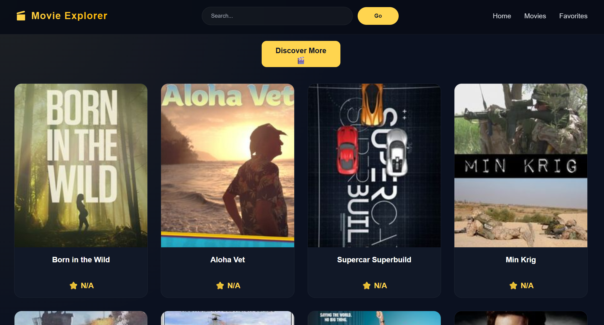
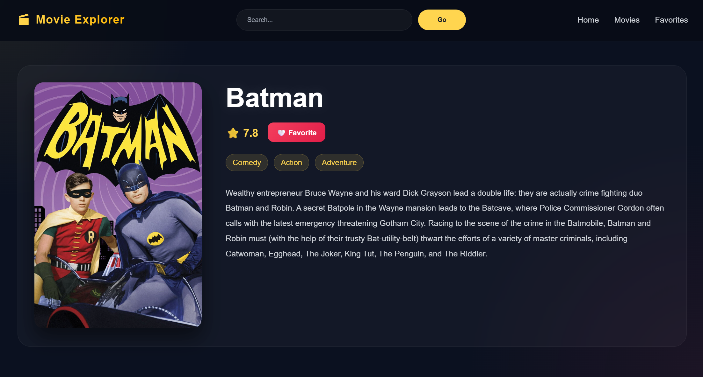
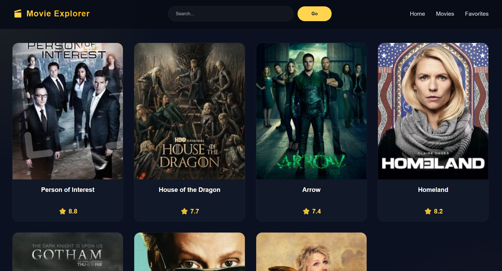

# 🎬 Movie Explorer

A responsive movie discovery application built with **React** and **Vite** that allows users to search for TV shows and movies using the **TVMaze API** and save favorites using **Local Storage**.

---

## 🚀 Features

- 🔍 Search TV shows and movies
- 🌐 Real-time data fetching using the TVMaze API
- ❤️ Add and remove favorites
- 💾 Favorites persist using Local Storage
- ⚛️ Built with React Hooks
- 📱 Fully responsive design
- ⚡ Fast and modern user interface

---

## 🛠️ Tech Stack

- React
- Vite
- JavaScript (ES6+)
- CSS
- TVMaze API
- Local Storage

---

## 📸 Screenshots

### Home Page



### Movies Page



### Search Results



### Favorites



---

## ⚙️ Installation

Clone the repository:

```bash
git clone https://github.com/preety-makkar/movie-explorer-react.git
```

Move into the project directory:

```bash
cd movie-explorer-react
```

Install dependencies:

```bash
npm install
```

Start the development server:

```bash
npm run dev
```

---

## 📂 Project Structure

```text
movie-explorer-react/
│
├── public/
├── src/
├── screenshots/
│   ├── home.png
│   ├── movies.png
│   ├── search-results.png
│   └── favorites.png
│
├── README.md
├── package.json
├── package-lock.json
└── vite.config.js
```

---

## 🎯 Learning Outcomes

This project helped me gain practical experience with:

- React Components
- React Hooks (useState, useEffect)
- API Integration
- State Management
- Local Storage
- Responsive Web Design
- Modern Frontend Development Workflow

---

## 🔮 Future Improvements

- Genre-based filtering
- Pagination support
- Detailed show information pages
- Watchlist functionality
- Dark Mode

---

## 👨‍💻 Author

Developed by **Preety Makkar**
